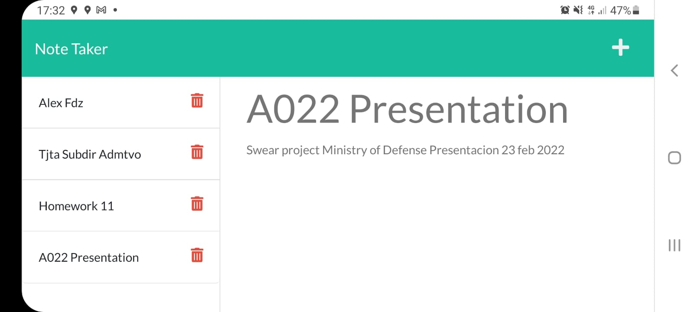

#  👓 Note Taker App

## 📄 Description

In this code I build a Note Taker App made with Node.js and Express.jss, we can add, remove and get notes saved in a remote server without using databases, just with a JSON file.

## ⚙⚙ Web Page Functionality

The following image shows the Note Taker App:

You can get into the Note Taker App in the next link [Note Taker App](https://guarded-gorge-18778.herokuapp.com).

